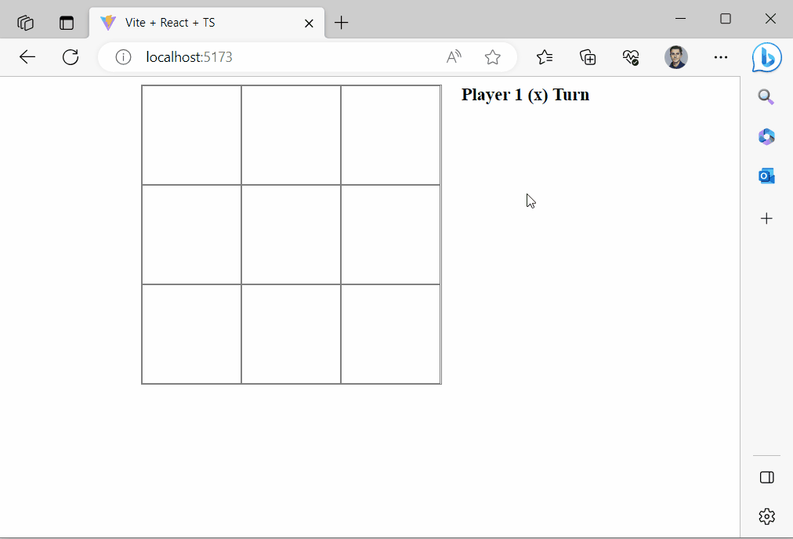

# quarkus-react-webapp

This is "Quarkus App" (backend) + "React App" (frontend) template.

You need:
 - Java 17
 - Node JS
 - Maven
 - Docker (because in dev mode I am using dev services)

The application can be packaged using:
```shell script
mvn clean package
```

It produces the `quarkus-run.jar` file in the `target/quarkus-app/` directory. The application is now runnable using `java -jar target/quarkus-app/quarkus-run.jar`.
> If you try that you'll notice that backend calls fail - because you need DB to make it work and that stuff needs to be configured. But UI works ok, you can try to open http://localhost:8084/ to check.

It is a standard way to build Quarkus project, but in this case you also get frontend app built and added to JAR file.
Check `pom.xml` for details.

In a nutshell, to serve static resources from the application jar, you must place them in the META-INF/resources directory of your application.
Then Quarkus will serve your files - and that's what happens during the build.


### Running the application in dev mode

Quarkus App (backend) - is very simple - a few REST endpoints. But everything (starting from DB layer) is done with Reactive API.

To run:
```shell script
mvn compile quarkus:dev
```

React App (frontend) - it's Tic-Tac-Toe game (also very simple React app bootstrapped with Vite).

To run:
```shell script
npm run dev
```

That's it. Simple open that UI app in your browser and you can play. The app makes calls to Quarkus backend 
and there's even DB running as dev service.


